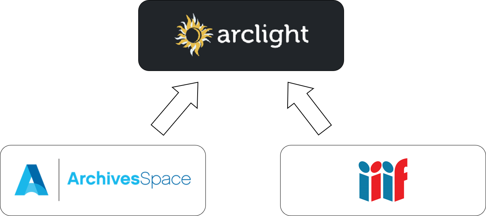

{: .arclight_diagram}

The [University at Albany Libraries](https://library.albany.edu/), together with the [Empire State Library Network (ESLN)](https://www.esln.org/), are further developing Arclight into a single platform for digital archives and special collections materials. This project will enable Arclight to provide discovery and access to digital materials, metadata, and full-text content using International Image Interoperability Framework (IIIF) manifests alongside archival description traditionally contained in finding aids.

#### Project Goals

* Allow users to discover online and offline collections in the same place
* Enable archivists to describe digital collections just like they do physical collections
	* Reduce metadata needs of digital collections so that archivists can make more digital materials available with their always-limited resources
* Simplify archives technology for smaller or under-resourced libraries
* Experiment with inheritance when indexing multilevel archival description

#### Using archival methods for digital access

Archives best practices are designed specifically to allow repositories to efficiently manage tremendous volumes of materials. Since current Digital Asset Management Systems (DAMS) and other digital repositories are designed for libraries, not archives, archivists are unable to use these same methods to manage the large amounts of born-digital and digitized content they are now manage.

This project will allow Arclight to provide access to both archival description and digital objects, including metadata and full-text OCR or transcription content, all in the same user interface.

#### Simplifying Technology

Instead of a traditional digital repository, we aim to enable archives to use their existing metadata, typically managed in ArchivesSpace, to provide access to digital materials. This uses International Image Interoperability Framework (IIIF) manifests, enabling Arclight and ArchivesSpace to work with any IIIF-compliant storage for digital objects. Pilot partners are using Archipelago, Islandora, and ContentDM, while UAlbany is forgoing a digital repository and storing digital objects on network file shares according to a detailed specification.

Implementing Arclight is still challenging for most archives. We will also create an ArchivesSpace plugin that lowers implementation barriers.

#### Iterative Usability Testing and Experimentation

Joining description from finding aids, digital object metadata, and full-text content in a single search interface will provide both usability challenges and new opportunities to experiment with weighting and inheriting description according to archival theory and standards. This includes both the weight of content fields (containing OCR or transcription text) and metadata so that digital objects are visible in results but do not overwhelm titles and notes. There is also interesting potential for indexing file, series, and collection level metadata with digital object records at lower weights. The final phase of the project will examine this by undertaking iterative user experience testing.

